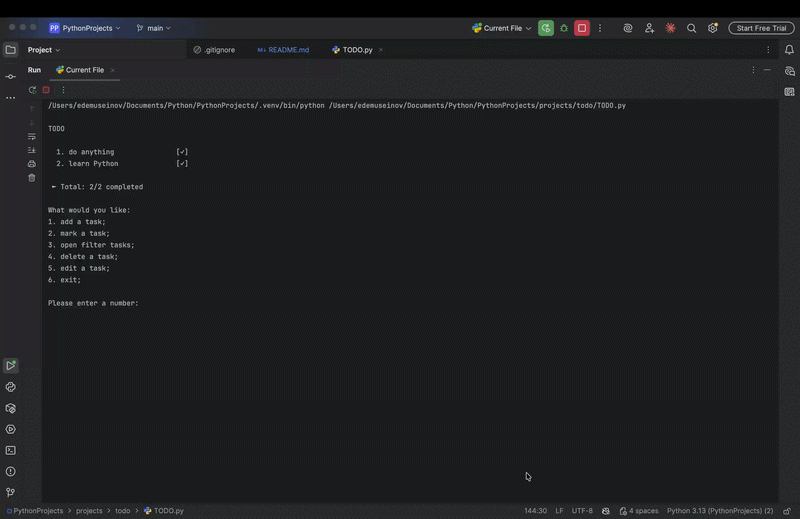

# TODO CLI 📋

A command-line task manager built with Python. Tasks are saved to a JSON file and persist between sessions.

## Demo



## Features

- Add, edit, and delete tasks
- Mark tasks as done
- Filter by status: all / done / undone
- Shows only 3 tasks on startup — the rest are hidden until you open the filter
- Tasks saved to `tasks.json` — nothing is lost after exit
- Input validation — won't crash on wrong input

## Tech Stack

- Python 3
- JSON (no external dependencies)

## Setup

```bash
python TODO.py
```

## Controls

```
1. Add a task
2. Mark a task as done
3. Open filter
4. Delete a task
5. Edit a task
6. Exit
```

## What I Learned

- How to structure a CLI app with functions and a main loop
- Reading and writing JSON for persistent storage
- Input validation with try/except
- Using lambdas to pass actions as arguments to functions
